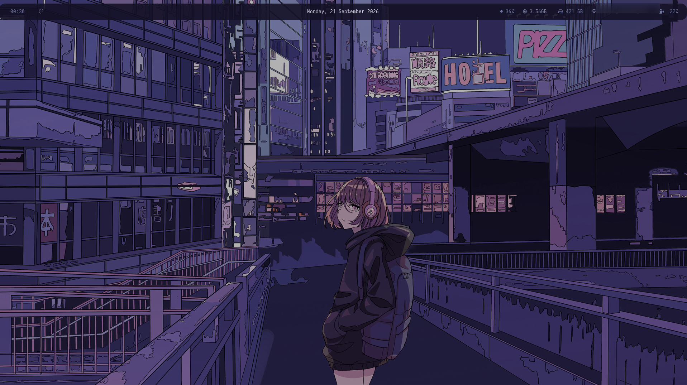
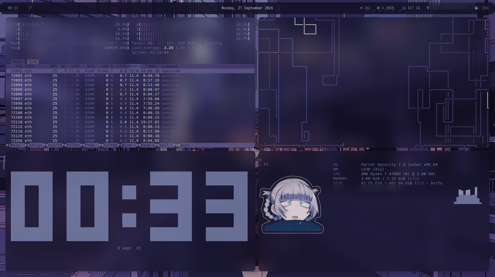
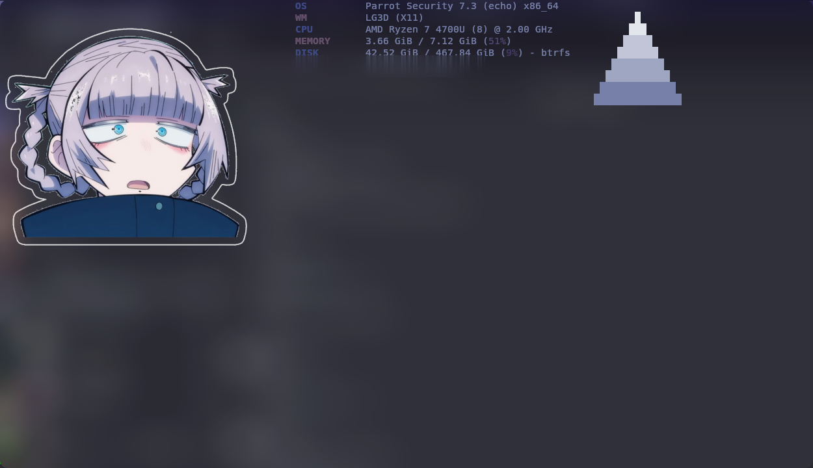
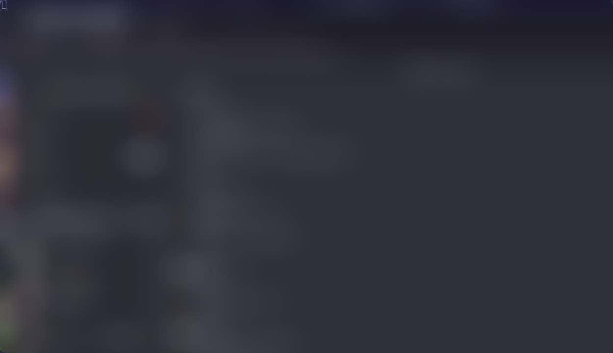
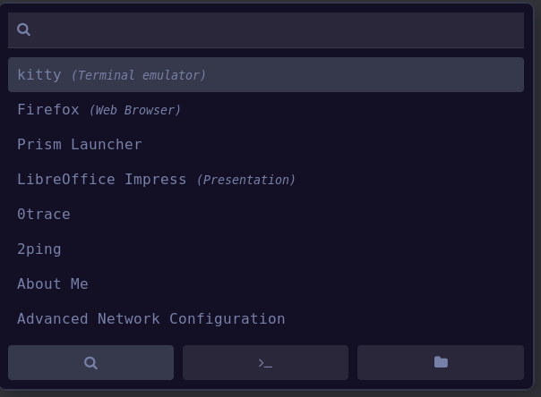
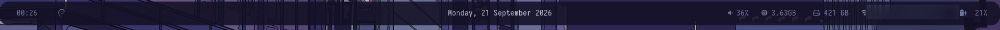

# dotfiles

**A colour-adaptive ParrotOS rice — Debian + bspwm, built on top of
[Colorful](https://github.com/m4nqn/Colorful).**

- **It changes colour with your wallpaper.** `colorChange` reads the palette out
  of the current wallpaper and repaints kitty (text, background and all 16 ANSI
  colours), polybar, rofi, dunst and the cava/`ff` bar gradient — switch the
  wallpaper and the whole desktop follows.
- **Debian, not Arch.** Built for [ParrotOS](https://parrotsec.org/) (Parrot
  Security 7, Debian based) instead of the usual Arch ricer stack.
- **bspwm + sxhkd.** Tiling window manager, hotkey daemon, polybar, picom
  compositing and dunst notifications.
- **One of the first ParrotOS rices.** Parrot is a security distro, not a
  rice-first one — this is an early attempt at making it look this good.
- **Based on [Colorful](https://github.com/m4nqn/Colorful)** — the polybar and
  rofi foundation this setup grew out of, customised heavily since.
- **`ff`** — a fastfetch dashboard that draws a cava spectrum to the right of
  the info block, with wide/narrow layouts and an animated GIF mode.

## Screenshots

### Desktop



### fastfetch, btop and peaclock



| `ff` | `ff 2` — animated apple |
| --- | --- |
|  |  |

| rofi launcher | polybar |
| --- | --- |
|  |  |

## Stack

| What | Program |
| --- | --- |
| Distro | [ParrotOS](https://parrotsec.org/) (Debian based) |
| Window manager | [bspwm](https://github.com/baskerville/bspwm) |
| Hotkeys | [sxhkd](https://github.com/baskerville/sxhkd) |
| Bar | [polybar](https://github.com/polybar/polybar) |
| Launcher | [rofi](https://github.com/davatorium/rofi) |
| Terminal | [kitty](https://sw.kovidgoyal.net/kitty/) (alacritty config included too) |
| Notifications | [dunst](https://dunst-project.org/) |
| Compositor | [picom](https://github.com/yshui/picom) (frosted glass) |
| Visualiser | [cava](https://github.com/karlstav/cava) + fastfetch wrapper (`ff`) |
| Shell | zsh + autosuggestions / syntax highlighting / fzf |
| Fonts | Iosevka Nerd Font, Fantasque Sans Mono, Terminus, Feather, Material Icons |
| Wallpaper | feh, with [pywal](https://github.com/dylanaraps/pywal) palettes |

## Install

```sh
git clone <this repo> ~/.dotfiles
cd ~/.dotfiles

./install.sh                 # configs, shell files, ~/.local/bin, fonts, wallpapers
./install.sh --system        # also /usr/local/bin scripts (sudo)
./install.sh --packages      # also apt/pip/zsh-plugin install
./install.sh --wallpapers    # also the animated wallpapers
./install.sh --all           # everything
```

Everything is **copied** (not symlinked); anything it replaces is first backed
up to `~/dotfiles-backup-<timestamp>/`. Log out and back in, or restart bspwm
with `super + alt + r`.

The apt package list is `packages/apt-manual.txt` (the full
`apt-mark showmanual` of this machine). Pywal is installed with
`pip install --user pywal`.

## Keybinds

| Keys | Action |
| --- | --- |
| `super + Return` | kitty |
| `super + ctrl + Return` | qterminal |
| `super + d` | rofi launcher |
| `super + ctrl + d` | rofi launcher, runs the picked program as root (rofi askpass) |
| `super + shift + s` / `Print` | screenshot (flameshot) |
| `super + q` | power menu (rofi) |
| `super + alt + w` | random wallpaper + re-theme (`changer`) |
| `super + alt + e` | wallpaper picker (sxiv) + re-theme |
| `super + alt + x` | wallpaper browser (sxiv) |
| `super + alt + b` | toggle window borders |
| `super + alt + f` | kitty font size picker |
| `super + {h,j,k,l}` / arrows | focus windows |
| `super + shift + {h,j,k,l}` | swap windows |
| `super + {1..9,0}` | desktops |
| `super + alt + {q,r}` | quit / restart bspwm |
| `XF86Audio{Raise,Lower}Volume`, `XF86AudioMute` | volume (pactl) |
| `XF86MonBrightness{Up,Down}` | brightness (brightnessctl) |

The full list is `config/sxhkd/sxhkdrc`.

## Wallpaper-driven colours (`colorChange`)

`~/.local/bin/colorChange [wallpaper]` reads the wallpaper's palette (via
pywal, with an ImageMagick fallback), picks the dominant accent colour and
re-writes:

- `~/.config/kitty/theme.conf` — terminal fg/bg/cursor + 16 ANSI colours
- `~/.config/polybar/colors.ini` — the bar palette
- `~/.config/rofi/colors/generated.rasi` — rofi
- `~/.config/dunst/dunstrc.d/99-colorChange.conf` — notifications
- `~/.cache/colorChange/gradient` — the cava/`ff` bar gradient

Then it reloads kitty (`SIGUSR1`), polybar and dunst. `changer` and
`wallpaper-selector` call it automatically, so the whole desktop follows the
wallpaper. Run it by hand any time: `colorChange ~/Pictures/Wallpapers/x.jpg`.

## `ff` — fastfetch + cava dashboard

`~/.local/bin/ff` draws fastfetch with a cava spectrum **to the right of the
info text**, with the bars colour-graded bottom-to-top.

- `ff` — astolfo3.png logo
- `ff 2` — animated apple.gif (scaled and timed to 48 fps, drawn with
  `kitten icat`; cached in `/tmp`)
- `FF_DEBUG=1 ff` — print the computed geometry
- Terminal width < 120 cols switches to a smaller logo so the bars still fit;
  very narrow windows fall back to a single full-width cava line.

Needs a terminal with the kitty graphics protocol (kitty). In other terminals
fastfetch falls back to its ASCII logo.

## Notes

- `ctrl + alt + p/d` (workspace preview) are commented out: they need
  `xeventbind`, which is not packaged.
- The animated wallpapers need `xwinwrap` to actually play (also not packaged).
- `config/` and `home/` are machine-specific in places (battery `BAT1`,
  interface `wlp1s0`, `amdgpu_bl0`); adjust for your hardware.

## Credits

This rice stands on other people's work. Files that come from elsewhere:

- [m4nqn/Colorful](https://github.com/m4nqn/Colorful) — the polybar/rofi
  foundation and several helper scripts this setup grew out of.
- [adi1090x/rofi](https://github.com/adi1090x/rofi) — the rofi theme
  collection (`config/rofi/colors`, 69 themes, MIT/GPL per upstream).
- [woefe/git-prompt.zsh](https://github.com/woefe/git-prompt.zsh),
  [woefe/zsh](https://github.com/woefe) — `wbase.zsh` and the prompt.
- [zsh-users](https://github.com/zsh-users) — zsh-autosuggestions,
  zsh-completions, zsh-history-substring-search.
- [zdharma-continuum/fast-syntax-highlighting](https://github.com/zdharma-continuum/fast-syntax-highlighting),
  [junegunn/fzf](https://github.com/junegunn/fzf).
- Fonts: Iosevka Nerd Font, Fantasque Sans Mono, Terminus, Feather, Material
  Design Icons.
- The "frosted glass" picom config and various bits originally from the
  bspwm ricer community (b4skyx/dotfiles, justTOBBI, etc.).

Everything else (the `ff` wrapper, `colorChange`, `changer`,
`wallpaper-selector`, `powermenu`, `change-borders`, `font-changer`, polybar
config edits, …) is mine.

## License

[MIT](LICENSE) for my own files; third-party files keep their upstream
licenses (see Credits).
